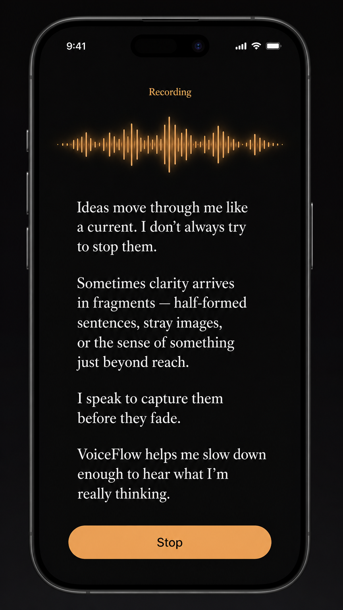
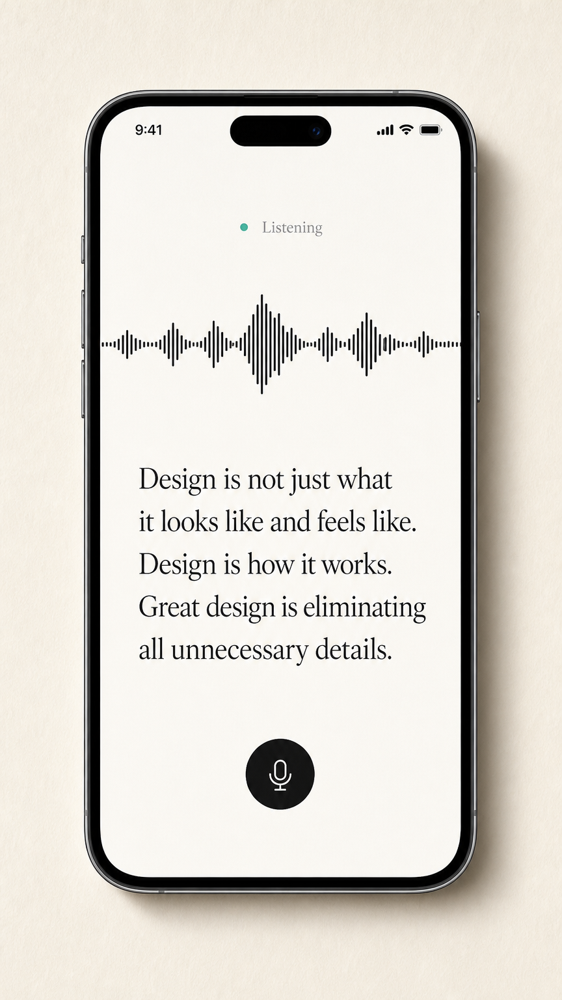
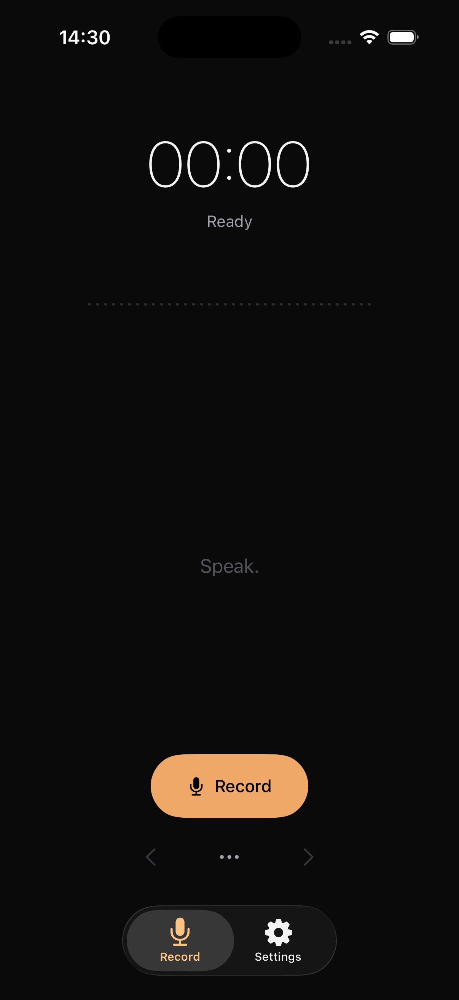
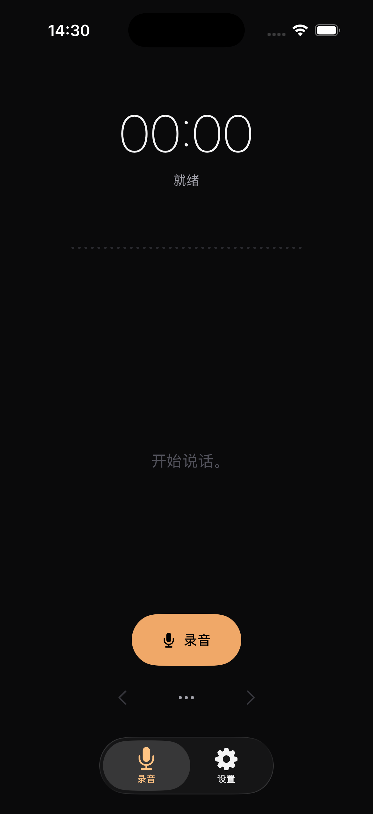
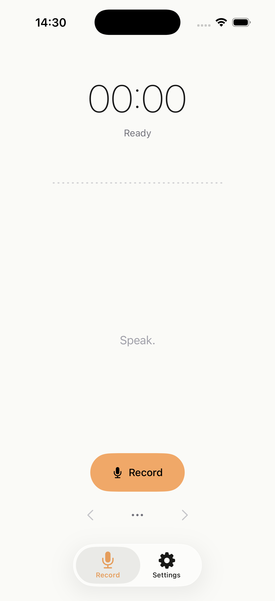
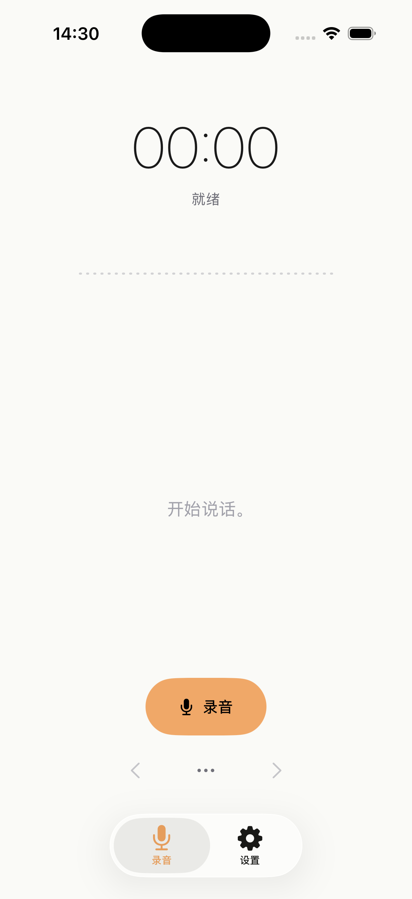

# VoiceFlow 设计 Spec — 暖琥珀 / 深墨与纸白双模式

本文件是 VoiceFlow UX 重做的实施 spec，不是评审记录。它取代了之前的"诊断 + 多方向探索"草稿，专注一件事：把视觉方向锁定在"夜间深墨 + 暖琥珀"与"日间纸白 + 同色琥珀点缀"这一对设计语言上，并把它拆成可以直接照着改 SwiftUI 代码的规格。

视觉灵感来自之前生成的候选 B（夜间）和候选 D（日间），两者共享同一套设计原则，只是底色和文字色互换。

## 设计原则（适用于双模式）

1. **唯一视觉锚点是波形**。屏幕只有一个真正的"主角"——一段实时音量波形。所有其他元素（状态文字、转写、按钮）围绕它布置，且权重明显低于它。
2. **单一识别色：暖琥珀 `#F0A868`**。这是整个 app 唯一允许出现的色相。所有"次要信息"（次级文字、分隔线、占位符）一律走灰阶。SwiftUI 默认的 `.blue / .red / .green / .purple` 全部不用。
3. **无边框、无卡片、无填色背景块**。Transcript 不要 `RoundedRectangle.stroke`，按钮可以有底但不要有外框，分组靠间距而非容器。
4. **字号建立层级，颜色不建立层级**。同一种文字色（主白 / 主墨）下用字号差异区分主次，不靠灰度高低。次级灰只用于真正次级的信息（占位符、状态注释）。
5. **极慢、极轻的动效**。所有状态切换走 ease-in-out 250-350ms、opacity crossfade 优先于 scale/position。不要 spring，不要 bouncing。
6. **文案克制**。"Start Recording" → "Record"；"Test Connection" → "Test"；占位文字"Your transcription will appear here." → "Speak."（或干脆无 placeholder，留白即可）。
7. **可选功能不占主屏权重**。OpenCode 从底部主 CTA 降级到 transcript 区右上角的 ghost button 或 menu 入口。Copy 也降级——主屏不再有显眼的 Copy 按钮，复制走自动 + 转写区上方的小 ghost button。

## 双模式色板

色板是这次重做的核心决策。两套模式共用一组 token，只换语义映射。

### 夜间模式（候选 B 派生）

| Token | Hex | 用途 |
|---|---|---|
| `bg.primary` | `#0A0A0B` | 主背景（接近纯黑、极轻微暖偏移） |
| `bg.secondary` | `#141416` | 次级背景（settings list 行 hover、modal） |
| `text.primary` | `#F4F4F5` | 主文字、转写正文 |
| `text.secondary` | `#A1A1AA` | 次级文字（状态文字、计时器副标） |
| `text.tertiary` | `#52525B` | placeholder、disabled |
| `divider` | `#27272A` | 极细分隔线（Settings 行间） |
| `accent` | `#F0A868` | 唯一识别色：录音中波形、CTA 文字、可点按 link |
| `accent.muted` | `#F0A86833` | accent 的 20% alpha 版本，用于轻提示 |

### 日间模式（候选 D 派生）

| Token | Hex | 用途 |
|---|---|---|
| `bg.primary` | `#FAFAF7` | 主背景（带极轻微暖偏移的纸白） |
| `bg.secondary` | `#F2F2EE` | 次级背景 |
| `text.primary` | `#1A1A1A` | 主文字、转写正文（深墨而非纯黑） |
| `text.secondary` | `#71717A` | 次级文字 |
| `text.tertiary` | `#A1A1AA` | placeholder、disabled |
| `divider` | `#E4E4E1` | 极细分隔线 |
| `accent` | `#F0A868` | 同夜间，色相不变 |
| `accent.muted` | `#F0A86833` | 同夜间 |

实现上用一个 `enum DesignTokens` 暴露语义颜色（`Color.bgPrimary` 等），内部用 `Color(light:dark:)` 双值定义，自动跟随系统 colorScheme。整个 app 不再出现 `Color.blue / .red / .gray.opacity(0.3)` 这类 ad-hoc 写法。

### 录音状态的颜色语义

当前实现用蓝/绿/橙/红圆点表达六种状态，违反"单一识别色"原则。新方案：

| 状态 | 表达方式 |
|---|---|
| idle / ready | 波形为静态平直细线，主文字 `text.primary` |
| recording（连接好） | 波形脉动，颜色 `accent`，状态文字"Listening" / "聆听中" |
| recording（重连中） | 波形脉动颜色 `text.secondary`（灰），状态文字"Reconnecting" |
| recording（断开） | 波形脉动颜色 `text.tertiary`（更灰），状态文字"Stream disconnected" |
| transcribing | 波形收拢为 indeterminate 细线动画，颜色 `accent` |
| error | 状态文字 `accent`（不用红），用文字承担警示，不用色彩 |

不再出现绿色、橙色、红色色点。所有状态变化通过：(a) 波形形态；(b) 状态文字；(c) 偶尔的 accent 出现/消失 来表达。**整屏在任何时刻最多出现一处 accent 色**。

## 字体

- 系统字体保持 SF，但显式选择 design 变体。
- 计时器："00:42" — SF Pro Display Thin 56pt。这是 hero 字号，是除波形外的第二大视觉锚点。
- 状态文字（"Listening" / "Reconnecting" / "Speak."）— SF Pro Text Regular 14pt，`text.secondary`。
- Transcript 正文 — SF Pro Text Regular 17pt，行距 1.4，颜色 `text.primary`。如果想再贵一点，可以选 New York Medium 17pt 作为正文字体，给"出来的文字"以书面感。这个换字体的尝试放在第二步（默认先用 SF Pro Text，观察后再升级）。
- 按钮文字（仅 CTA 上） — SF Pro Text Medium 15pt。

## 屏幕布局

### Record 屏（夜间）

```
   ┌─────────────────────────────┐
   │                             │
   │          00:42              │  ← 56pt Display Thin, text.primary
   │       Listening             │  ← 14pt Regular, text.secondary
   │                             │
   │   ∼∼∼╱╲╱╲╲╱╲╱╲∼∼∼∼∼         │  ← 实时波形，高度 80pt，accent 色
   │                             │      （静态时是细水平线，accent.muted）
   │                             │
   │  Whatever the user said,    │  ← Transcript：17pt SF Pro Text
   │  rendered as plain text     │      text.primary，行距 1.4
   │  on the background — no     │      左右内边距 32pt，无任何边框
   │  border, no input field.    │      上下与波形距离 48pt
   │                             │
   │                             │
   │                             │
   │         ┌─ Record ─┐        │  ← 主 CTA：胶囊按钮，宽 ~70% 屏宽
   │         │          │        │      高 56pt，accent 填色 + 黑色文字
   │         └──────────┘        │      Stop 时换 text.primary 描边版本
   │                             │
   │   < · · · ⋯ ⋯ ⋯ · · · >    │  ← 历史导航 + more menu，全部 ghost
   │                             │      icon，18pt SF Symbol，text.tertiary
   └─────────────────────────────┘
                                       底部系统 TabView：透明背景 + accent
```

### Record 屏（日间）

完全相同的布局，只是 `bg.primary` 变成纸白、`text.primary` 变成深墨。`accent` 不变。

### Settings 屏

抛弃 SwiftUI `Form`。改成一组 `List` 风格的行，但去掉 inset grouped 容器，只保留 1pt `divider` 线。

```
   ┌─────────────────────────────┐
   │  Settings                   │  ← 28pt SF Pro Display Medium
   │                             │
   │  ─────────────────────────  │
   │  AI Builder                 │  ← 17pt Medium, text.primary
   │  Connected · Test           │  ← 13pt Regular, text.secondary
   │  ─────────────────────────  │     "Connected" 是状态、"Test" 是
   │  OpenCode                   │     可点击的 inline ghost link
   │  Not configured             │
   │  ─────────────────────────  │
   │  Language                   │
   │  English (System)           │
   │  ─────────────────────────  │
   └─────────────────────────────┘
```

每一行点击进二级页面输入 token / password / 切语言。当前的"所有输入框一次全展开"是工程视角的产物——产品视角下，token 已经保存好的用户不应该每次进 Settings 都看见一个 secure field。

**实施分两阶段**：第一阶段保留现有 Form 结构（避免一次性改太多），只换色板、字体、去掉 `RoundedRectangle.stroke` 边框，让 Settings 看起来克制；第二阶段（V2）再把 Form 重写成自定义 list。这次 PR 做第一阶段。

## 组件级规格

### `WaveformView`（新组件）

```swift
struct WaveformView: View {
    var level: Double      // 0.0–1.0, 实时音量
    var color: Color       // .accent / .secondary / .tertiary 依状态切换
    var isIdle: Bool       // true 时显示静态细线

    // 高度固定 80pt，宽度撑满 — 不带边框
}
```

实现上用 30-40 根细 bar 横向排列，每根高度由 `level` + 随机噪声生成。idle 时所有 bar 高度归零变成 1pt 细线，opacity 0.4。

### `CapsuleButton`（替代 `ColoredButtonStyle`）

```swift
struct CapsuleButton: View {
    let title: String
    let role: Role         // .primary / .secondary / .destructive
    let action: () -> Void

    // 高 56pt，圆角 = 高度 / 2（完全胶囊形）
    // primary: accent 填色 + 黑色文字
    // secondary: 透明底 + 1pt accent 描边 + accent 文字
    // destructive: 透明底 + 1pt text.tertiary 描边 + text.secondary 文字
    // 宽度跟随 intrinsic content size + 横向 padding 32pt
    // 不再硬编码 fixedWidth / fixedHeight
}
```

去掉 `fixedHeight: 60, fixedWidth: 120` 这套硬编码。intrinsic size + min/max width 让中英文都自适应。这直接修了之前英文"Start Recordi…"被截断的问题。

### `GhostIconButton`（新组件，替代当前 chevron / menu / info button）

```swift
struct GhostIconButton: View {
    let systemName: String
    let action: () -> Void

    // 圆形 36pt tap target，内部 18pt SF Symbol
    // 颜色 text.tertiary，disabled 时降到 12% opacity
    // 无背景填色，无边框
}
```

### `StatusText`（新组件，替代 `RecordingStatusHeaderView`）

```swift
struct StatusText: View {
    let key: LocalizedStringKey   // "Listening" / "Reconnecting" / "Speak." 等
    let role: Role                // .neutral / .accent / .muted

    // 14pt Regular，居中
    // neutral → text.secondary
    // accent → accent
    // muted → text.tertiary
}
```

不再有色点。状态完全靠文字 + 波形颜色承载。

### Transcript 区

去掉 `RoundedRectangle stroke 0.3`。`TextEditor` 改成无背景、无边框，外面套 `ScrollView`，左右内边距 32pt，顶部与波形距离 48pt。空状态文案从 "Your transcription will appear here." 改成 "Speak."（极简），日间夜间都用 `text.tertiary` 色。

字符计数 "0 characters" 右下角小标 — **删掉**。这是工程师 debug 时加的，产品上没有意义。

## 按钮和入口的重新分布

### Record 屏当前底部"Copy + Send to OpenCode + info"三件套 → 全部移走

- **Copy 按钮**：移除。复制本来就是录音完成自动执行的（`autoCopy`），底部不需要再放显眼按钮。如果用户想手动重新复制，放在 transcript 区上方一个 ghost 图标按钮（小 `doc.on.doc` SF Symbol，无文字）。
- **Send to OpenCode 按钮**：从主屏底部移到 more menu（三点菜单）里。OpenCode 是可选功能，不应该在主屏占用黄金区域。Menu 里的项目变成：Copy（再次手动复制）、Save Recording、Resend Recording、Send to OpenCode。
- **🧠 emoji**：移除。SF Symbol 用 `paperplane`（普通发送）或 `terminal`（OpenCode 是 dev 工具）替代。
- **info `i` 按钮**：移除。OpenCode 的解释挪到 Settings 的 OpenCode 行下方的副标。

### Record 屏主控件区

从"chevron + 主按钮 + menu + chevron"四件横向排布，改成两层：
- 上层：主胶囊按钮（"Record" / "Stop"）居中
- 下层：左右各一个 chevron + 中间一个 `ellipsis.circle` more menu，三个 ghost 图标，等距分布

主按钮和 ghost 控件不再竞争同一行视觉权重。

## TabView 的处理

**这次不做自定义 tab bar**。理由前面 audit 时已经写过：肌肉记忆、a11y、复杂度。但要做这两件事让系统 TabView 弱化存在感：

1. `.tint(.accent)` 把选中态从系统蓝换成琥珀；
2. `.toolbarBackground(.ultraThinMaterial, for: .tabBar)` 在 iOS 17+ 让 tab bar 半透明融入背景；
3. 图标改用 outline 版本（`mic` 而非 `mic.fill`，`gearshape` 而非 `gearshape.fill`），选中态才填色。

如果后续要做"无 tab + 右上 gear"的更激进版本，再单独一次 PR。

## 双语版式

所有按钮、状态文字、Settings 行全部走 intrinsic content size。验收标准：英文最长文案（"Reconnecting" / "Test Connection" / "Start Recording"）和中文最长文案（"测试连接" / "开始录音" / "正在重连"）在同一组件下都不截断、不挤压、不换行（除非该组件本来就允许 wrap）。

`ColoredButtonStyle` 当前的 `fixedHeight: 60, fixedWidth: 120` 硬编码是英文截断的直接原因，必须撤掉。

## 动效

- 录音状态切换：250ms ease-in-out crossfade，无 scale
- 波形音量更新：60Hz，无 explicit animation（已经是连续值，硬上 animation 会拖延滞后感）
- 按钮按下：opacity 0.85，duration 100ms ease-out（按下反馈快，松开缓和）
- 转写文字流式追加：每次 partial 更新无动画（避免文字跳动），final commit 时整段 fade-in 350ms

## 落地步骤

1. 新建 `DesignTokens.swift`（`Color` extension + 字号常量），把所有颜色 / 字号 / 间距集中。
2. 新建 `Views/Components/WaveformView.swift`、`CapsuleButton.swift`、`GhostIconButton.swift`、`StatusText.swift`。
3. 删除 `ColoredButtonStyle.swift`、`RecordingStatusHeaderView.swift`、`RecordingTimerView.swift`（其内容并入新结构）。
4. 重写 `RecordView`：去掉标题、去 emoji、去边框、按上面 ASCII 布局重组。
5. 改 `SettingsView`：保留 Form 结构（第一阶段），只换色板、字体、去掉容器边框、文案克制化（"Test Connection" → "Test"）。
6. 改 `MainTabView`：tint + material + outline 图标。
7. 改 UI test：保留所有 accessibilityIdentifier，修文案匹配（"Start Recording" → "Record"），加 `record.waveform`、`record.statusText` 新 identifier。
8. 重新生成中英双语截图（夜间 + 日间共 4 张），更新 `docs/screenshots/`。
9. `docs/working.md` 加一条变更记录。
10. 开 PR。

## UI Test 影响清单

下列 UI test 断言需要更新（不删，是改）：

- `app.staticTexts["VoiceFlow"]` → 删除该断言（标题不再显示）
- `app.buttons["Start Recording"]` → `app.buttons["Record"]`（按钮文案改）
- `app.buttons["Stop"]` 保持
- `app.buttons["Copy"]` → 改为查找 `record.copyButton` identifier（主屏不再有显眼 Copy）
- `app.buttons["Send to OpenCode"]` → 改为通过 more menu 触发
- `app.staticTexts["Copied to clipboard."]` 保持（caption 文案不变）
- `record.statusIndicator` 不再存在 → 改用 `record.statusText` 取值断言
- `record.statusTitle`("VoiceFlow") 不再存在 → 删
- `RecordingStatusHeaderView` 的 accessibility tree → 由 `StatusText` 接管，对应 identifier 改为 `record.statusText`

所有以 `record.*Button` / `settings.*` 结尾的 accessibilityIdentifier 保持不变。这是这次 redesign 的"接口契约"——视觉可以全换，identifier 不能动，UI test 才能继续指导回归。

## 参考视觉

设计语言锚定在 GPT image 生成的两张 mood board：

夜间（候选 B 派生）：


日间（候选 D 派生）：


这两张定义了色温、留白节奏、字体气质；按钮位置、波形形态、文案细节按上面的 spec 走。

## 实施结果

代码改完后从模拟器（iPhone 17 Pro / iOS 26.3.1）抓的四张实拍——中英文 × 日夜两模式：

| | 英文 | 简体中文 |
|---|---|---|
| 夜间 |  |  |
| 日间 |  |  |

对照 spec 验收：

- 深墨 / 纸白双模式色板都落地，琥珀作为唯一识别色出现在主按钮、tab 选中态、其他位置一律灰阶。
- 56pt thin "00:00" + 14pt "Ready / 就绪" 状态文字组成 hero 区域。
- 波形 idle 态为水平虚线（accent.muted），录音时切到 active 模式实时呼吸（这次截图是 idle，所以看到的是虚线）。
- 主按钮胶囊形、intrinsic 宽度，中英文都不截断。
- Placeholder "Speak." / "开始说话。" 居中，与上方计时器、波形和下方按钮共享同一中轴。
- 标题 "VoiceFlow" 已删除，色点已删除，Copy/Send-to-OpenCode 已收进 more menu。
- Tab bar 选中态琥珀色，背景 `.ultraThinMaterial`，图标用 outline 版本（`mic` / `gearshape`，选中态由系统填色）。

之前的初版会把"Speak." placeholder 贴左屏边，是因为 SwiftUI `TextEditor` 内部 inset 与外层 padding 没对齐。最终方案是 placeholder 与 TextEditor 共用 ZStack 但分别布局，placeholder 居中、TextEditor 仍按左对齐排版——这样空状态视觉居中，有内容后自然走阅读流。
